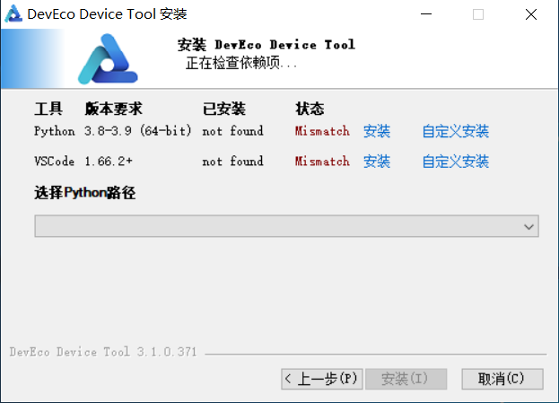
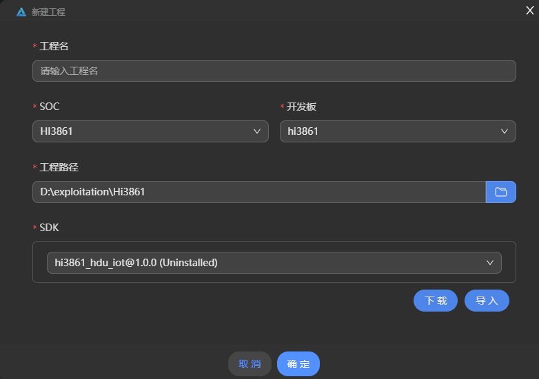
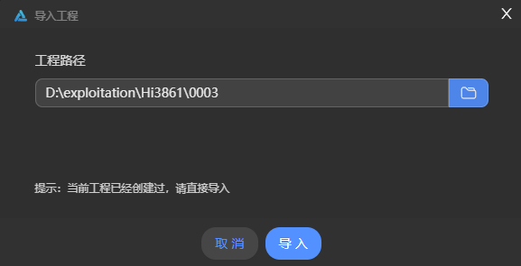
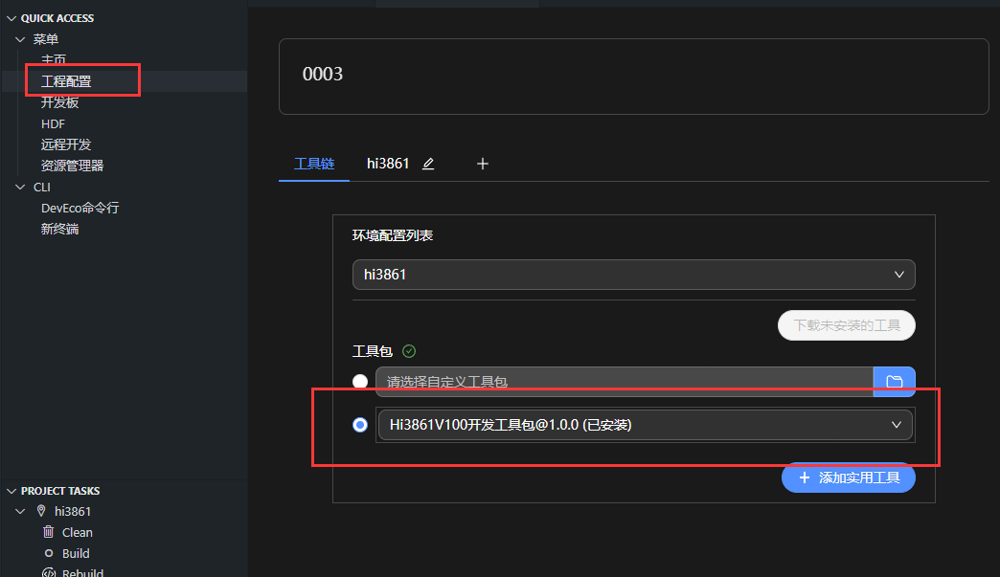
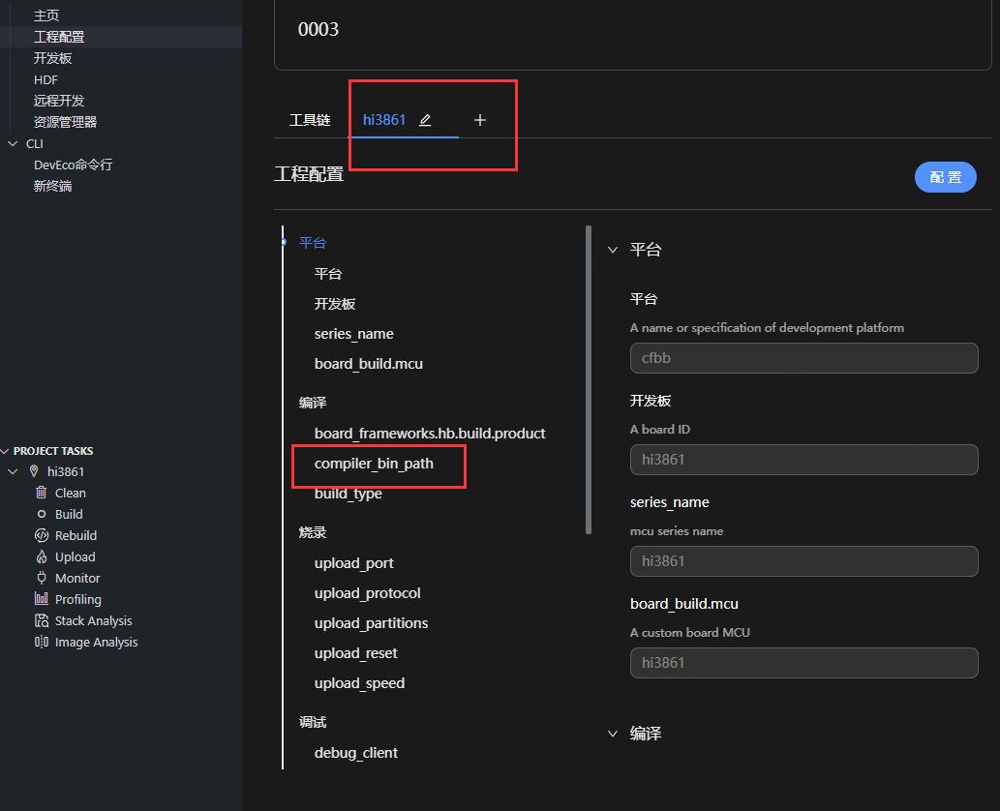
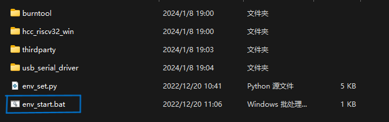
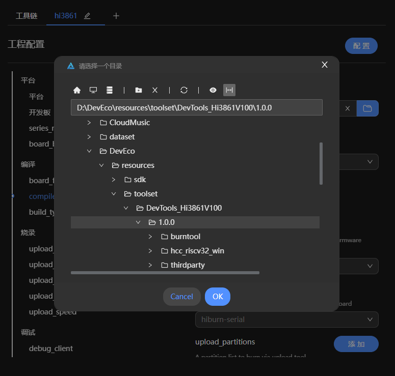
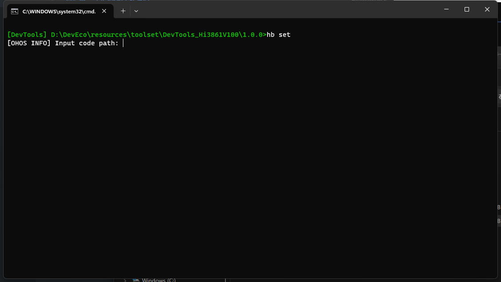
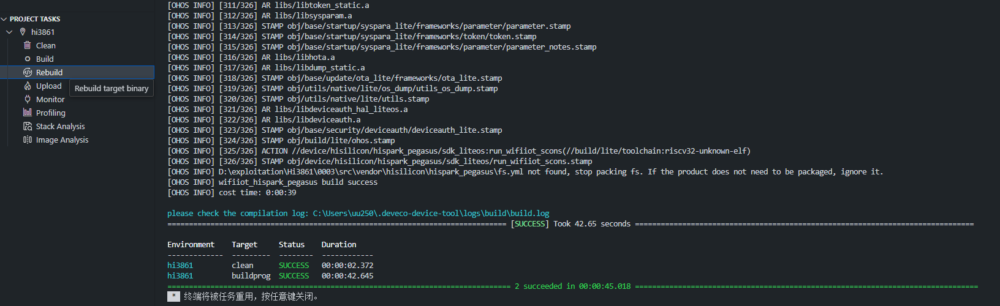
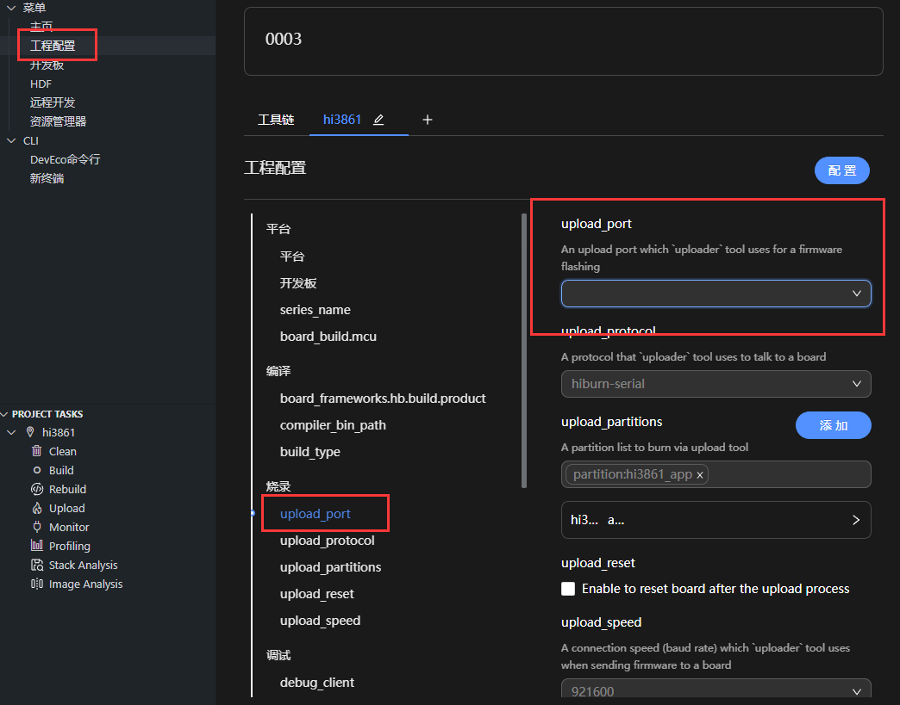

# 硬件学习仓库

## 前言

首先大家可能会听学长学姐提及我们IoT组有一个硬件的学习仓库，但是大家可能会质疑他的权威性，首先可以告诉大家，这个仓库他是历届学长学姐的经验总结出来的，是一个可参考的仓库，它相当于是给大家有一个清晰的学习规划，我们会尽可能的使他变得更全面！

## Hi3861的学习（OpenHarmony南向开发）

    首先我们要了解什么是基于IDE开发，什么是基于命令行开发？

- >  IDE（集成开发环境） 就是电脑上编程时用的应用  

- >  命令行就一般指在终端进行开发

那么根据不同的习惯有不同的开发方式，这里我们主要介绍一下IDE（集成开发环境），尤其是windows的开发方式

### windows下的DevEco Device Tool开发环境搭建

- 下载[DevEco Device Tool](https://device.harmonyos.com/cn/develop/ide#download)最新`Windows`版本软件包。

- 解压DevEco Device Tool压缩包，双击安装包程序，单击下一步进行安装。

- 设置DevEco Device Tool的安装路径，请注意安装路径不能包含中文字符，不建议安装到`C`盘目录，单击下一步。

    

- 然后按照上面的提示进行点击，其中会有检查`python`和`vscode`的步骤，记住！python的版本最好是`3.8`或`3.9`

- 打开`Visual Studio Code`，进入`DevEco Device Tool`工具界面。至此，DevEco Device Tool Windows开发环境安装完成。

### 创建工程并获取源码

- 打开DevEco Device Tool，进入Home页，点击New Project创建新工程。

- 在新工程的配置向导页，配置工程相关信息，包括：
    > 工程名：（随便写）  
    > SOC：Hi3861  
    > 工程路径：选择合适的路径  

    

- 工程配置完成后，下载SDK（如果没有，点击SDK旁边的下载），点击`Confirm`，DevEco Device Tool会自动启动OpenHarmony源码的下载。由于OpenHarmony稳定版本源码包体积较大，请耐心等待源码下载完成。
    > SDK是软件开发工具包，辅助开发某一类软件的相关文档、范例和工具的集合

- 完成以后，源码环境已经搭建完成，下面我们就可以愉快的进行Hi3861的开发了！

- **注意：** 如果没有源码下载成功，我在Hi3861文件夹中提供的有SDK的压缩包和源码环境的压缩包，可以自行进行导入

### 附：导入SDK和编译工具包
    说明：在下载时可能会出现下载失败，这里可以将这种情况解决
- 选择工程源码，这里我们先下载`Dev-Tool`（工具包）和`hi3861_hdu_iot`（SDK），这里可直接通过网盘进行下载[Hi3861环境](https://cloud.189.cn/t/r2QBNr2umqUv )（访问码：r3kc）
    > `Dev-Tool` 在 `hi3861环境/DevTools/DevTools_Hi3861V100.zip`  
    > `hi3861_hdu_iot` 在 `hi3861环境/hi3861_hdu_iot/0001.zip`

- 将两个压缩包解压后，先将工程源码导入到DevEco Device Tool
      
  
- 然后点击DevEco Device Tool的工程配置，查看工具包是否安装，没有安装可以点击下载，下载成功就配置好了，如果下载失败请继续跟着文档往下走
    

- 点击hi3861，点击`compiler_bin_path`
    

- 这里主要是配置编译工具的路径，其实主要是`env_start.bat`的作用
      
    

- 这里我打开一下`env_start.bat`，给你们看一下hi3861的编译环境（命令行），基于Hb框架
    

- 到此我们的SDK和工具包已经配置完成！下面我们就可以愉快的进行Hi3861的开发了！
    > 如果还是有问题请提交一个issue！

### 验证环境
    说明：这里我们对于工具包的验证只有编译层面的，对于烧录我们不做验证

- 源码什么都不需要更改，我们点击`DevEco Device Tool`工具界面，在下方的`project tasks`中点击`Rebuild`，然后开始编译，出现以下画面则证明编译成功！  
    > 源码一开始的`applcations`子系统编译的是`wifi_iot_sample_app`组件，其组件的Build.gn只有编译`startup`这个业务模块，所以我们初学者不需要对源码进行修改就可以验证环境的完备性

    

## Hi3861打印hello world！（第一个实操案例）

### 确定目录结构

开发者编写业务代码时，务必先在`./applications/sample/wifi-iot/app`路径下新建一个目录（或一套目录结构），用于存放业务源码文件。

例如：在`app`下新增业务`my_first_app`，其中`hello_world.c`为业务代码，`BUILD.gn`为编译脚本，具体规划目录结构如下：
```
.
└── applications
    └── sample
        └── wifi-iot
            └── app
                └── my_first_app
                  │── hello_world.c
                  └── BUILD.gn
.
└── applications
    └── sample
        └── wifi-iot
            └── app
                └── my_first_app
                  │── hello_world.c
                  └── BUILD.gn
```

### 编写业务代码

新建`./applications/sample/wifi-iot/app/my_first_app`下的`hello_world.c`文件，在hello_world.c中新建业务入口函数HelloWorld，并实现业务逻辑。并在代码最下方，使用OpenHarmony启动恢复模块接口`SYS_RUN()`启动业务。（SYS_RUN定义在`ohos_init.h`文件中）
```c
#include <stdio.h>
#include "ohos_init.h"
#include "ohos_types.h"

void HelloWorld(void)
{
    printf("[DEMO] Hello world.\n");
}
SYS_RUN(HelloWorld);
#include <stdio.h>
#include "ohos_init.h"
#include "ohos_types.h"

void HelloWorld(void)
{
    printf("[DEMO] Hello world.\n");
}
SYS_RUN(HelloWorld);
```

编写用于将业务构建成静态库的`BUILD.gn`文件。

新建`./applications/sample/wifi-iot/app/my_first_app`下的`BUILD.gn`文件，并完成如下配置。

如步骤1所述，BUILD.gn文件由三部分内容（目标、源文件、头文件路径）构成，需由开发者完成填写。
```
static_library("myapp") {
    sources = [
        "hello_world.c"
    ]
    include_dirs = [
        "//utils/native/lite/include"
    ]
}
static_library("myapp") {
    sources = [
        "hello_world.c"
    ]
    include_dirs = [
        "//utils/native/lite/include"
    ]
}
```
static_library中指定业务模块的编译结果，为静态库文件libmyapp.a，开发者根据实际情况完成填写。
sources中指定静态库.a所依赖的.c文件及其路径，若路径中包含"//“则表示绝对路径（此处为代码根路径），若不包含”//"则表示相对路径。
include_dirs中指定source所需要依赖的.h文件路径。

### 添加新组件

修改文件`build/lite/components/applications.json`，添加组件`hello_world_app`的配置，如下所示为`applications.json`文件片段，"##start##“和”##end##“之间为新增配置（”##start##“和”##end##"仅用来标识位置，添加完配置后删除这两行）：
> 说明： 本章节操作是以OpenHarmony-v3.1-Release版本为例进行操作的，该版本中，组件配置文件为`build/lite/components/applications.json`；若源码版本大于等于OpenHarmony 3.2 Beta2时，组件配置文件为`build/lite/components/communication.json`。
```json
{
  "components": [
    {
      "component": "camera_sample_communication",
      "description": "Communication related samples.",
      "optional": "true",
      "dirs": [
        "applications/sample/camera/communication"
      ],
      "targets": [
        "//applications/sample/camera/communication:sample"
      ],
      "rom": "",
      "ram": "",
      "output": [],
      "adapted_kernel": [ "liteos_a" ],
      "features": [],
      "deps": {
        "components": [],
        "third_party": []
      }
    },
##start##
    {
      "component": "hello_world_app",
      "description": "hello world samples.",
      "optional": "true",
      "dirs": [
        "applications/sample/wifi-iot/app/my_first_app"
      ],
      "targets": [
        "//applications/sample/wifi-iot/app/my_first_app:myapp"
      ],
      "rom": "",
      "ram": "",
      "output": [],
      "adapted_kernel": [ "liteos_m" ],
      "features": [],
      "deps": {
        "components": [],
        "third_party": []
      }
    },
##end##
    {
      "component": "camera_sample_app",
      "description": "Camera related samples.",
      "optional": "true",
      "dirs": [
        "applications/sample/camera/launcher",
        "applications/sample/camera/cameraApp",
        "applications/sample/camera/setting",
        "applications/sample/camera/gallery",
        "applications/sample/camera/media"
      ],
```
### 修改单板配置文件

修改文件`vendor/hisilicon/hispark_pegasus/config.json`，新增`hello_world_app`组件的条目，如下所示代码片段为`applications`子系统配置，"##start##“和”##end##“之间为新增条目（”##start##“和”##end##"仅用来标识位置，添加完配置后删除这两行）：
```
      {
        "subsystem": "applications",
        "components": [
##start##
          { "component": "hello_world_app", "features":[] },
##end##
          { "component": "wifi_iot_sample_app", "features":[] }
        ]
      },
```

### 编译
按照上面的步骤点击`Rebuild`，显示`success bulid`的字样。
    

### 烧录
我们将bearpi（hi3861开发板）连接电脑后点击`hi3861`，然后点击`upload_port`，选择带有ch340的串口，如果没有ch340的标识，可能你没有安装ch340的串口驱动，这里我提供以下网盘下载链接 [CH340驱动下载](https://cloud.189.cn/t/zyAny2JjiAzq) （访问码：rgd6）
   

**注意：选好port后就可以点击`project tasks`的`Upload`按钮，在出现`continue`的时候，按下bearpi上的复位按钮**

## 串口查看
点击`Monitor`后按下bearpi的复位按键，就可以查看打印出来的Hello world啦


## Hi3861的简单编译流程说明
在上面我们提到了子系统，组件，业务模块等，这些都是我们openharmony框架的概念，这里我们不做过多的赘述。我们主要讲一讲openharmony是怎么知道我们要编译那一个文件夹。

首先，给大家讲解一下openharmony启动流程。
  ```
  阶段1：core 内核启动

  阶段2：core system service 内核系统服务

  阶段3：core system feature 内核系统特性

  阶段4：system startup 系统启动

  阶段5：system service 系统服务

  阶段6：system future 系统特性

  阶段7：application-layer service 应用层服务

  阶段8：application-layer feature 应用层特性
  ```
上述八个阶段是从编译器开始build文件，然后一步一步传入到主板让主板进行编译的过程。

openharmony是怎么执行这8个阶段的，首先ohos_init.h定义了8个宏，用于让一个函数以“优先级2”在系统启动过程的1-8阶段执行。这里涉及到一个优先级问题，在系统启动的某个阶段，会有多个函数被调用，优先级决定了调用顺序。
```
优先级范围：0-4。

优先级顺序：0, 1, 2, 3, 4。
```

上述就是程序编译的优先顺序。
即函数会被标记为入口，在系统启动过程的1-8阶段，以“优先级2”被调用。

我们不需要完全了解整个的编译流程，我们只需要懂得从子系统开始后面怎么走的就可以了。

- 我们打开`/src/vendor/bearpi/bearpi_hm_nano/config.json`，这个是bearpi的子系统配置文件，我这里只选取部分作为展示。大家可以看到在我注释的地方有两个单词`applications`和  `wifi_iot_sample_app`，有没有比较熟悉，没错，他就是我们在hello world案例中的 applcations 和 app 文件夹！证明我们编写的代码是在applications这一个子系统下的，并且是在wifi_iot_sample_app这个组件下的。
  > subsystem：子系统  
  > component：组件
    ```c
    {
    "product_name": "bearpi_hm_nano",
    "ohos_version": "OpenHarmony 1.0",
    "device_company": "bearpi",
    "board": "bearpi_hm_nano",
    "kernel_type": "liteos_m",
    "kernel_version": "",
    "subsystems": [
      {
        "subsystem": "applications",  //子系统名称
        "components": [
          { "component": "wifi_iot_sample_app", "features":[] }  //组件名称
        ]
      },
      {
        "subsystem": "iot_hardware",
        "components": [
          { "component": "iot_controller", "features":[] }
        ]
      },
      {
        "subsystem": "hiviewdfx",
        "components": [
          { "component": "hilog_lite", "features":[] }
        ]
      },
      {
        "subsystem": "distributed_schedule",
        "components": [
          { "component": "samgr_lite", "features":[] }
        ]
      },
      {
        "subsystem": "security",
        "components": [
          { "component": "hichainsdk", "features":[] },
          { "component": "deviceauth_lite", "features":[] },
   --+-       { "component": "huks", "features":
            [
              "disable_huks_binary = false",
              "disable_authenticate = false",
    ```
- 不过为什么组件是wifi_iot_sample_app这一大长串的，但是我们是在app文件夹下添加我们的业务代码呢？好问题！这就要看另一个文件了，`build/lite/components/applications.json`，我截取里面包含wifi_iot_sample_app的这一段，可以看到`dirs`指向`applications/sample/wifi-iot/app`的app文件夹，他的`targets`也是app文件夹的位置，也就是说这个组件的名字虽然叫`wifi_iot_sample_app`，但是实际起作用的是app文件夹下的业务代码模块。
  > dirs：路径  
    targets：目标

  ```json
      "adapted_kernel": [ "liteos_a" ],
      "features": [],
      "deps": {}
    },
    {
      "component": "wifi_iot_sample_app",     //组件名字
      "description": "Wifi iot samples.",
      "optional": "true",
      "dirs": [
        "applications/sample/wifi-iot/app"    //目标文件夹路径
      ],
      "targets": [
        "//applications/sample/wifi-iot/app"  //目标文件夹
      ],
      "rom": "",
      "ram": "",
      "output": [],
      "adapted_board": [ "hi3861v100" ],
      "adapted_kernel": [ "liteos_m" ],
      "features": [],
      "deps": {
          "components": [
            "utils_base"
        ]
      }
    },
    {
      "component": "kit_framework",
      "description": "",
      "optional": "true",
      "dirs": [
        "applications/kit_framework"
  ```
- 然后我们在去看app文件夹下的`Build.gn`文件，这里你可能会对这个文件产生疑惑，我会对其讲解一下，这里我们先专心编译流程。这里我们看到lite_component("app")的app，说明这个gn文件是是配置app文件夹的，下面的startup就是我们需要编译的业务模块。
  我们在上面的时候创建hello wprld业务的时候在hello world的文件夹里面也创建了一个Build.gn文件，其实我们在app的Build.gn文件中的`features`板块中应该填写`业务文件夹名称 : 业务Build.gn名称`，但是startup的Build.gn名字与文件夹的名字重了，所以可以只用写一个startup
  ```
  # app的Build.gn
    import("//build/lite/config/component/lite_component.gni") # 配置 Go 语言的工具链的脚本文件

    lite_component("app") {    # 编译文件夹名称是app
        features = [
            "startup",   # startup的Build.gn名字与文件夹的名字重了，所以可以只用写一个startup
        ]
    }
  ```
  ```
  # startup的Build.gn
    source_set("startup") {    # 业务Build.gn名称是startup
      sources = [

      ]

      include_dirs = [ ]
  }
  ```

- 因为startup的Build.gn不是很完整，这里我们使用demolink的Build.gn做讲解，`static_library`是静态库的意思，在这里面填的就是业务Build.gn的名字，`sources`板块是我们在这个业务模块里需要编译的源文件，`include_dirs`是我们所有源文件需要的头文件（库文件）的路径
  ```
    static_library("example_demolink") {      # 业务Build.gn的名字是example_demolink
      sources = [
          "helloworld.c"    # 需要编译的源文件
      ]

      include_dirs = [        # 源文件需要的头文件（库文件）的路径
          "//utils/native/lite/include",
          "//domains/iot/link/libbuild"
      ]
  }
  ```
- 最后我们总结一下，一开始我们是在`config.json`里面子系统的组件到`applications.json`里面的`wifi_iot_sample_app`的app文件夹，再到app文件夹下的Build.gn，再到业务模块里面的Build.gn

## Hi3861的内核开发
**内核开发文档编写主要借鉴：**
> [OpenHarmony智能开发套件[内核编程·上]](https://ost.51cto.com/posts/23938)  
> [OpenHarmony智能开发套件[内核编程·下]](https://ost.51cto.com/posts/23997)  
> [BearPi-HM_Nano案例开发](https://gitee.com/bearpi/bearpi-hm_nano/blob/master/applications/BearPi/BearPi-HM_Nano/sample/README.md#/bearpi/bearpi-hm_nano/blob/master/applications/BearPi/BearPi-HM_Nano/sample/A1_kernal_thread/README.md)  
> [openharmony编写“Hello World”程序](https://docs.openharmony.cn/pages/v4.0/zh-cn/device-dev/quick-start/quickstart-ide-3861-helloworld.md/)  

### 线程的使用
在我们初次接触到openharmony轻量系统开发（hi3861开发）的时候，第一个接触的肯定是如何使用线程来完成我们的任务，那么接下来就让我们开始利用线程来跟他说一声“Hello,openharmony!”

#### 

### 说明
    

目前正在更新Hi3861的资料